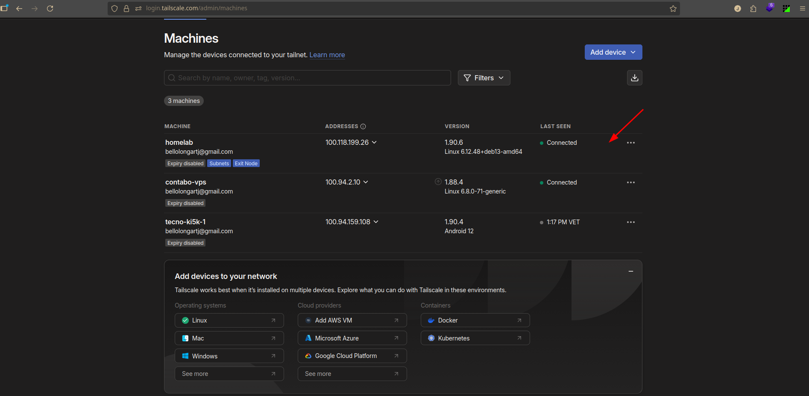
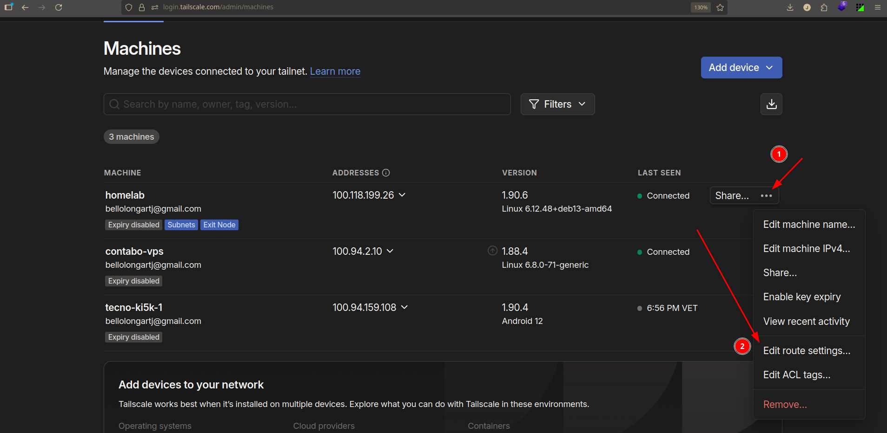
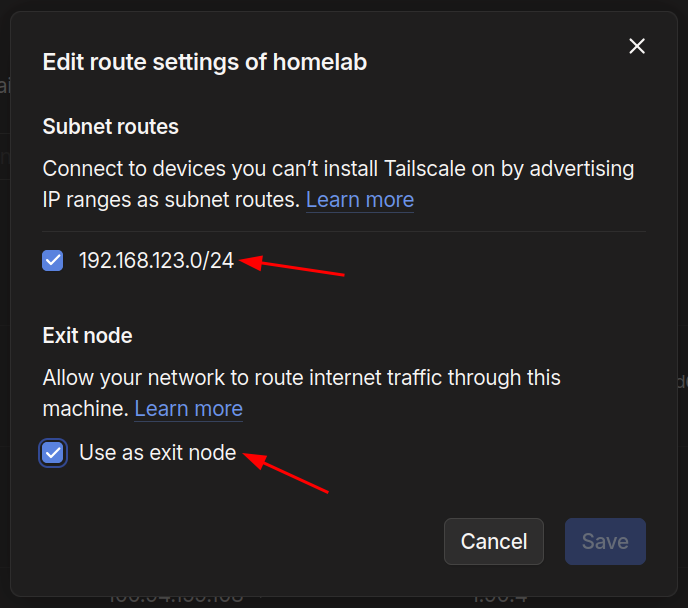
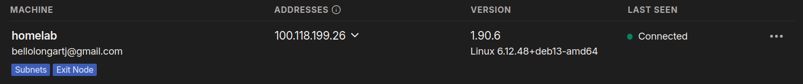
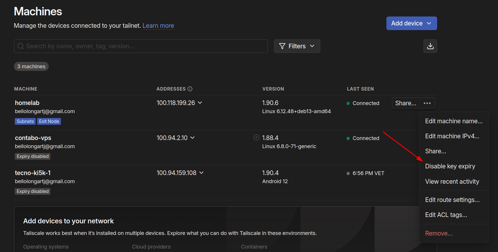
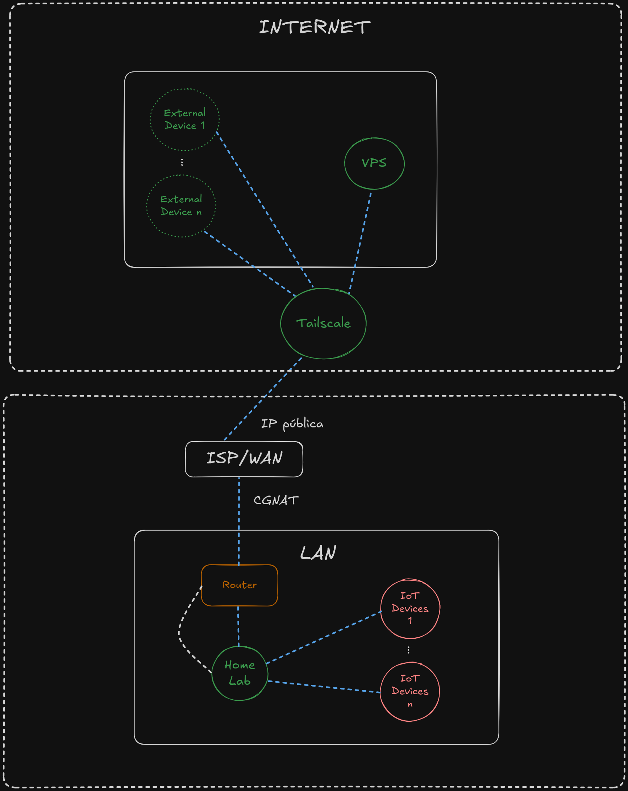
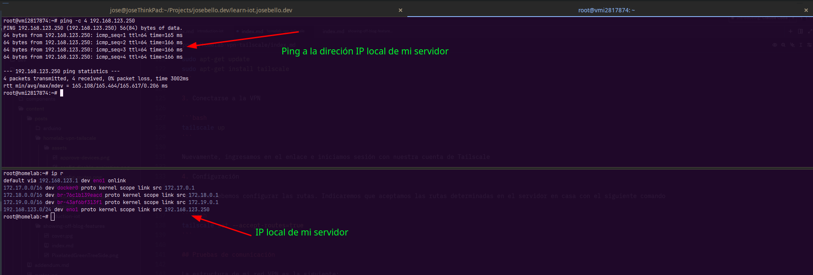
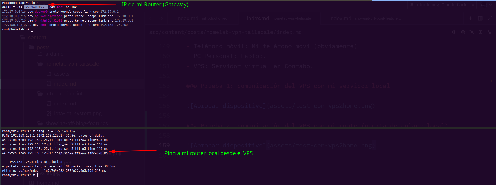
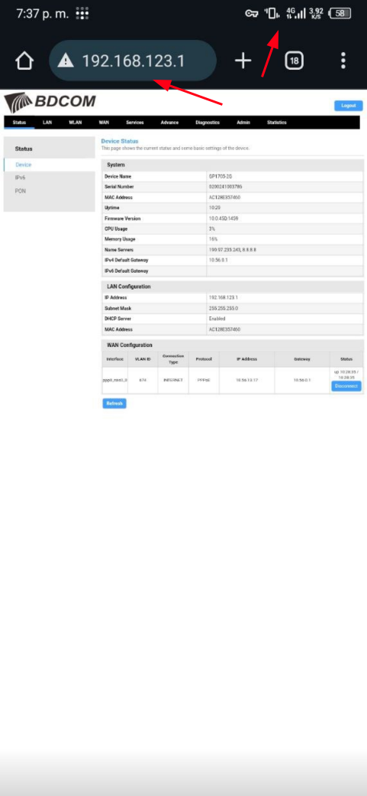

## Tailscale

[Tailscale](https://tailscale.com) es VPN multiplataforma que cuenta con una Web UI muy amigable e intuitiva. Además,es fácil de configurar y tiene varias opciones muy interesantes. Aprovecharemos su capa gratuita para crear una VPN para nuetro HomeLab.

Nuestra estructura de red, incluyendo la VPN, involucrará a los servidores de Tailscale, por lo cual, si no te importa o te da igual que una empresa de tercero esté como intermediario en tu VPN puedes continuar con este tutorial.

Pero... ¿Por qué necesitamos una empresa intermediaria? Bueno, en realidad, la VPN también la podríamos montar en un VPS, pero todo el mantenimiento, configuración tanto de firewall como de la propia VPN, las configuraciones y monitoreo de seguridad, todo eso lo tendríamos que hacer nosotros. En cambio con Tailscale, solo tenemos que preocupanos por conectar los dispositivos. Así que vamos con Tailscale (después haremos otro tutorial explorando otras opciones).


## Pasos para instalar y configurar Tailscale

::::note
Documentación Oficial: [Install Tailscale](https://tailscale.com/kb/1347/installation)
::::

### Configuración e instalación en el HomeLab o servidor de casa

::::important
Este tutorial de instalación es solo para Linux(Debian Base). En Windows... bueno, averiguatelas. Puedes seguir los pasos de la documentación oficial de Tailscale.
::::

1. Añadimos los repositorios:

```bash
curl -fsSL https://pkgs.tailscale.com/stable/ubuntu/oracular.noarmor.gpg | sudo tee /usr/share/keyrings/tailscale-archive-keyring.gpg >/dev/null
curl -fsSL https://pkgs.tailscale.com/stable/ubuntu/oracular.tailscale-keyring.list | sudo tee /etc/apt/sources.list.d/tailscale.list
```

2. Instalamos Tailscale

```bash
sudo apt-get update
sudo apt-get install tailscale
```

3. Ahora iniciamos el servicio de Tailscale

```bash
sudo tailscale up
```

Esto nos llevará a una página web donde deberemos autenticarnos con nuestra cuenta de Tailscale y aceptar los términos y condiciones. Una vez hecho esto, Tailscale se instalará y configurará automáticamente en nuestro sistema.

El panel de [Tailscale Console](https://login.tailscale.com/admin/machines) verás la lista de dispositivos conectados, y deberías ver el dispositivo que acabas de configurar. Si no está conectado, es porque primero debes aprobarlo desde el mismo panel de administración.



::::note
A mi no aparece el botón de aprobar porque ya lo hice, pero ahí te debería aparecer si no lo has aprobado antes.
::::

4. Configuración

**Exit Node**: Esta opción permite un dispositivo actúe como un nodo de salida para otros dispositivos en la red. Esto puede ser útil si queremos que nuestro dispositivo sea el punto de acceso para otros dispositivos en la red.

Por ejemplo, nos conectamos a la VPN desde nuestro smartphone, y lo configuramos con el Exit Node de nuestro servidor de casa, así, cuando nos conectemos a cualquier servicio o página web, nuestra solicitud saldrá por la IP de nuestra casa, y no directamente de la IP del smartphone. Esta parte es totalmente opcinal, ya que la VPN funcionaría completamente sin ella, pero puede ser útil para ciertas ocasiones.

```bash
tailscale set --advertise-exit-node
```

**Routes**: Las rutas son las que nos permiten que todos los dispositivos en nuestra red VPN se puedan comunicar entre ellos.

```bash
tailscale set --advertise-routes=192.168.123.0/24 # <-- Acá lo reemplazas la IP por la de tu casa.
```

**Aceptar la configuración en el panel de administración:**

En nuestro [panel de administracion de Tailscale](https://login.tailscale.com/admin/machines) debemos hacer click en las opciones de nuestro servidor:



Y marcamos las opciones **Subnet routes** y **Exit node**:



Nuestro servidor debería mostrar las etiquetas configuradas:



Por último, deshabilitamos la expiración para el servidor, ya que, por defecto, es de 90 días:



¡Listo! Ya tenemos nuestro VPN configurado. Ahora vamos a conectar otro dispositivo en la red para verificar la correcta comunicación.

::::tip
Échale un ojo a la [documentacion oficial de Tailscale](https://tailscale.com/kb/1415/quick-guides) para que explores otras configuraciones interesantes.
::::

### Configuración e instalación en los dispositivos de la red VPN

#### Android/IOS

La configuración en Android e IOS es sencilla, solo debes descargar la app desde la tienda de aplicaciones de tu S.O, inicias sesión con la misma cuenta que utilizaste para configurar la VPN en tu servidor de casa y ¡listo! Solo debes asegurarte que el dispositivo esté aprobado en el panel de Administración.

#### Linux

Para Debian, o cualquier distribución basada en ella, y también para Manjaro o Arch, los pasos son los mismos que los vistos anteriormente, con unas pequeñas diferencias en cuanto a la configuración:

1. Agregamos los paquetes:

```bash
curl -fsSL https://pkgs.tailscale.com/stable/ubuntu/oracular.noarmor.gpg | sudo tee /usr/share/keyrings/tailscale-archive-keyring.gpg >/dev/null
curl -fsSL https://pkgs.tailscale.com/stable/ubuntu/oracular.tailscale-keyring.list | sudo tee /etc/apt/sources.list.d/tailscale.list
```

2. Instalamos Tailscale

```bash
sudo apt-get update
sudo apt-get install tailscale
```

3. Nos conectamos a la VPN

```bash
tailscale up
```

Nuevamente, ingresamos en el enlace e iniciamos sesión con nuestra cuenta de Tailscale.

4. Configuración

Acá solo debemos configurar las rutas. Indicaremos que aceptamos las rutas determinadas en el servidor en casa con el siguiente comando

```bash
tailscale set --accept-routes=true
```

## Pruebas de comunicación

La estructura de mi red VPN es la siguiente:



Noten que Tailscale actua como nodo de distribución de toda nuestra red VPN.

**Dispositivos:**
- HomeLab: Servidor de casa
- IoT Devices: Dispositivos de monitoreo y automatización.
- VPS: Servidor virtual en Contabo.
- External devices: Laptop, Teléfono o cualquier otro dispositivo conectado a la red VPN fuera de la red local de casa.

### Prueba #1: Comunicación del VPS con mi servidor local



### Prueba #2: Comunicación del VPS con mi router(puerta de enlace local)



### Prueba #3: Accediendo al panel de administración de mi router local desde el exterior



Observen que estoy utilizando datos móviles y accediendo ip local de mi router.


## Extra

Si tenemos un VPS conectado a nuestra VPN, también lo podemos configurar como Exit node, y de está manera, podría actuar como nodo de salida para  nuestros dispositivos en la red VPN, es decir, nuestras solicitudes hacia Internet saldrían desde la IP de nuestro VPS, lo que ayuda a evitar bloqueos de páginas web y servicios que están restringidos para tu ubicación.

## Conclusiones

Tailscale es una VPN demásiado fácil de instalar y configurar. Creo que no tomaría ni 30 minutos tenerla totalmente lista y funcional. No solo nos brinda acceso a nuestro servidor o recursos en casa, también nos provee de una capa extra de seguridad al no tener que exponer puertos de nuestro router.

Una de las cosas que más me llamó la atención es su panel de administración, ya que tiene muchas herramientas para la gestión de nuestros dispositivos conectados a la VPN, y además su UX es simplemente hermosa.

Aún nos falta configurar los DNS locales, para así poder acceder a nuestros servicios mediante una URL, pero eso lo dejaremos para otro post.

Espero que este pequeño tutorial te haya servido.
